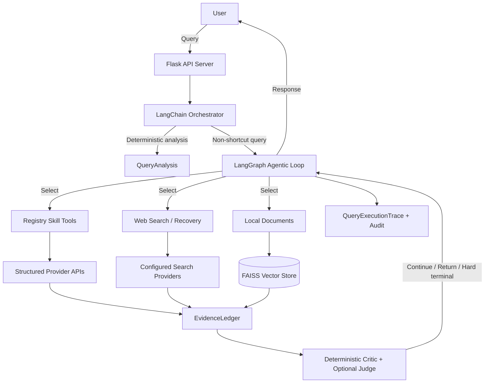
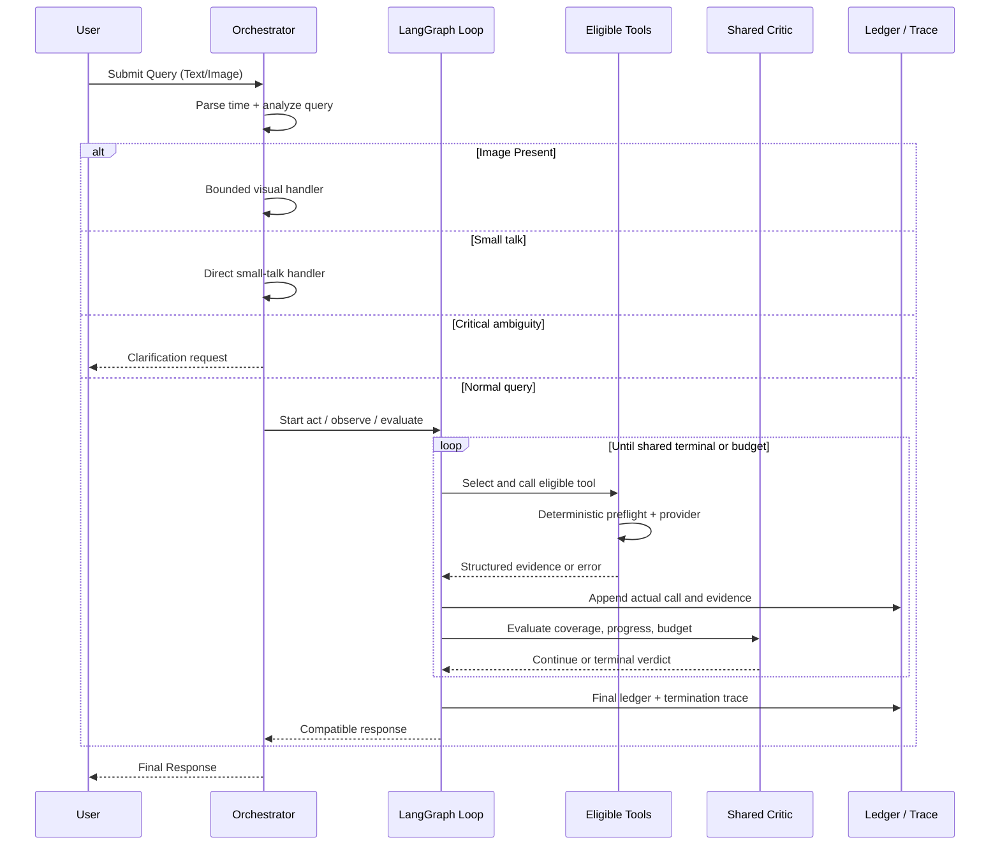

# Intelligent Search Engine (ISE) System Architecture

## 一：系统架构

### 1. 系统架构图

#### High-Level Architecture

#### Advanced Logic Flow

### 2. 技术栈 (Technology Stack)

*   **Backend Framework**: Flask (Python)
*   **LLM Provider**:
    *   **Primary**: GLM-4.6 (ZhipuAI/Zai) - Default for generation.
    *   **Termination Judge**: Optional configured model for semantic sufficiency; it cannot override deterministic gaps or budgets.
    *   **Vision Support**: Google Vision API + Vision-capable LLMs.
*   **Vector Database**:
    *   **Implementation**: LangChain VectorStore (FAISS based).
    *   **Embeddings**: HuggingFace (`all-MiniLM-L6-v2`).
*   **RAG Engine**:
    *   **Framework**: LangChain (Community & Core).
    *   **Retrieval**: Dense retrieval with similarity search.
*   **Reranking**:
    *   **Model**: Qwen3-rerank (Alibaba DashScope).
*   **Search & Data Sources**:
    *   **Web**: Brave Search, Google Custom Search.
    *   **Domain APIs**: Google Weather/Routes/Places, Finnhub, Yahoo Finance, TheSportsDB.

---

## 二：方法论与实现细节 (Methodology and Implementation Details)

本章节详细阐述了系统的核心方法论与具体实现细节。系统设计采用了模块化、分层架构，通过各组件的协同工作实现智能化、精准化的信息检索与生成。

### 1. Registry Skill 路由 (Registry Skill Routing)

系统不再使用统一领域分类器。`skills/registry.py` 从每个 package 的 `skill.yaml` 构建实际可用
工具面；weather、location、transportation、finance 与 sports handler 分别执行确定性 preflight。
缺少显式地点、球队、标的或起终点时直接拒绝，编排器再回落通用 Web，不让弱分类猜测终止检索。

*   **领域专用数据源 (Domain-Specific Sources)**:
    针对识别出的特定领域，系统集成了专门的 API 以提供比通用网页搜索更结构化、更权威的数据：
    *   **Weather**: 集成 **Google Weather API** (`weather.googleapis.com`)，获取实时气温、降水概率及未来预报。
    *   **Finance**: 集成 **Yahoo Finance** (`yfinance`) 和 **Finnhub**，能获取实时股价、公司财报及市场指数。
    *   **Sports**: 集成 **TheSportsDB**，提供明确球队或赛事的近期结果与后续赛程。
    *   **Transportation/Location**: 集成 **Google Routes API** 和 **Google Places API**，处理导航规划与地点检索。

*   **统一证据与降级 (Evidence and Fallback)**:
    skill provider 输出统一归一化为 `EvidenceItem`，保留 provider、tool-call 与来源等级 provenance。
    provider 错误、空数据或 preflight 拒绝都由唯一的 LangGraph loop 观察，并由模型选择其他可用工具。

### 2. 统一终止判据 (Unified Termination Critic)

    LangGraph `evaluate` 节点把证据覆盖、来源等级、约束、进度与剩余预算交给
    `utils/query_orchestration.py::evaluate_termination`。该函数返回
可审计的 action、缺项、failure types、hard-stop 标志和 rule hits。可选 `termination.judge` 只补充语义
    充分性：负向结论可以否决规则通过，正向结论不能清除确定性缺口或延长预算。静态计划和旧 LangChain
    `AgentExecutor` 均已删除，缺少 LangGraph 时明确失败，避免同一运行时存在第二套执行或停止逻辑。

### 3. 本地 RAG 架构与实施 (Local RAG Architecture & Implementation)

本地检索增强生成 (Local RAG) 模块旨在利用私有知识库回答问题，确保数据隐私并弥补通用大模型的知识盲区。该模块在 `rag/local_rag.py` 及 `langchain/langchain_support.py` 中实现。

*   **文档处理流水线 (Document Processing Pipeline)**:
    *   **加载器 (Loaders)**: `FileReader` (现由 `LangChainFileReader` 支持) 能够递归扫描指定目录，支持多种文件格式的解析：
        *   `.pdf`: 使用 `PyPDFLoader` 提取文本。
        *   `.md`: 使用 `UnstructuredMarkdownLoader` 解析 Markdown 结构。
        *   `.txt`: 使用 `TextLoader` 处理纯文本。
    *   **文本分块 (Text Splitting)**: 使用 `RecursiveCharacterTextSplitter` 进行精细化分块。经过实验调优，参数设定为 `chunk_size=1000` (字符) 和 `chunk_overlap=200`。这种配置既能保证每个块包含完整的语义段落，又能通过 20% 的重叠区防止关键信息被切断。

*   **向量索引与存储 (Vector Indexing & Storage)**:
    *   **Embedding 模型**: 选用 `all-MiniLM-L6-v2` (通过 `HuggingFaceEmbeddings` 加载)。该模型在保持极高推理速度的同时，在语义相似度任务上表现优异，生成 384 维的稠密向量。
    *   **向量数据库**: 底层采用 **FAISS (Facebook AI Similarity Search)**。`LangChainVectorStore` 类封装了 FAISS 的索引构建 (`index` 方法) 与持久化操作，支持在 CPU 环境下进行毫秒级的高效近邻搜索。

*   **检索与生成 (Retrieval & Generation)**:
    *   系统执行相似度搜索 (`similarity_search`)，默认检索 Top-5 最相关的文档块 (`k=5`)。
    *   检索到的文本块被拼接成一个 Context 字符串，并注入到 LLM 的 Prompt 中：*"基于以下已知信息...请回答用户问题"*。这种 In-Context Learning 的方式有效抑制了大模型的幻觉。

### 4. 多阶段检索优化：重排序与过滤 (Multi-stage Retrieval Optimization: Reranking & Filtering)

为了解决传统搜索引擎返回结果中存在的噪声问题，本系统在 `rag/search_rag.py` 和 `search/rerank.py` 中引入了先进的 **Re-ranking (重排序)** 机制。

*   **初筛阶段 (Initial Retrieval)**:
    `SearchRAG` 模块通过集成 Brave Search、Tavily 或 Google Custom Search API，首先获取较广泛的候选结果集 (通常为 Top-10 或 Top-20)。这些结果 (`SearchHit` 对象) 包含标题、URL 和简短摘要。

*   **重排序模型 (Reranking Model)**:
    系统实现了 `Qwen3Reranker` 类，对接阿里云 DashScope 的 `qwen3-rerank` 模型。不同于仅基于向量距离的粗排，Cross-Encoder 架构的 Rerank 模型会同时接收 Pair 对 (User Query, Document Chunk)，通过深层交互注意力机制计算相关性分数。
    *   **数据流**: 搜索结果被格式化为 `[{"query": "...", "content": "..."}]` 列表并发送至 API。
    *   **鲁棒性设计**: `_extract_ranking` 方法包含完整的错误处理逻辑，若 Rerank API 调用失败，系统会自动降级回退到原始搜索排序，确保服务的高可用性。

*   **智能过滤策略 (Intelligent Filtering Strategy)**:
    经过重排序后，系统执行严格的过滤逻辑以保证上下文质量：
    1.  **阈值过滤**: 只有 relevance score 高于 `min_rerank_score` (默认 0.0，可调优) 的结果才会被保留。
    2.  **多样性控制**: 引入 `max_per_domain` 参数 (默认 1)，限制来自同一域名的结果数量。这有效防止了单一来源 (如维基百科) 占据所有上下文窗口，迫使模型参考多元化的信息源。

*   **时序查询的细粒度回退 (Granular Fallback for Temporal Queries)**:
    针对 "QS ranking 2015-2023" 这类复杂的时序变迁查询，系统实现了 `_perform_granular_search_fallback`。如果初次宽泛搜索未能覆盖所有请求的年份，系统会通过 LLM 生成一系列特定年份的子查询 (e.g., "QS world university ranking 2015 CUHK", "QS world university ranking 2016 CUHK")，并行执行检索，最后将结果聚合。这种 "Scatter-Gather" 模式极大增强了系统处理纵向数据对比的能力。

### 5. Agent Workflow与多步推理 (Agent Workflow & Multi-step Reasoning)

当前默认由 `langchain/langchain_orchestrator.py` 中的 `LangChainOrchestrator` 负责确定性预处理，
随后把所有非短路查询交给唯一的 LangGraph loop。运行时不存在第二条执行路径：legacy
`SmartSearchOrchestrator` 已删除，缺少 LangChain/LangGraph 依赖时 CLI 明确失败而不降级。

*   **时间感知与解析 (Time Awareness & Parsing)**:
    内置的 `TimeParser` 工具 (`utils/time_parser.py`) 利用正则表达式能够精准识别自然语言中的时间限制 (如 "最近3天", "past 6 months")。解析出的 `TimeConstraint` 对象会被转换为搜索引擎接受的参数 (如 Google 的 `dateRestrict=d3` 或 Tavily 的 `time_range=month`)，从源头保证信息的时效性。

*   **决策与编排 (Decision & Orchestration)**:
    *   **Tool Choice**: 不再运行二元联网分类器或静态 query plan；模型在 loop 内通过选不选工具表达决策，`allow_search=false` 则确定性移除网络工具。
    *   **上下文注入 (Context Injection)**: 每次工具观察归一化为带实际 call provenance 的 `EvidenceItem` 并进入统一 ledger；缺项由同一 critic 决定继续还是终止。

*   **反思与闲聊处理 (Reflection & Small Talk)**:
    系统只对闲聊、视觉输入和关键歧义保留确定性短路。其他查询从第一轮起就在 ReAct loop 内执行；
    不存在首答后的 post-check 升级或第二个 fallback executor。

### 6. 多模态交互与视觉理解 (Multi-modal Interaction & Visual Understanding)

系统突破了纯文本的限制，在 `server.py` 和 Orchestrator 中构建了完整的多模态处理链路。

*   **视觉检索流水线 (Visual Retrieval Pipeline)**:
    当用户上传图片时，系统不仅是“看”图片，而是将其转化为可检索的信号：
    1.  **特征提取**: 调用 **Google Vision API** 的 `label_detection` 和 `web_detection` 端点。
    2.  **元数据转换**: 从 API 响应中提取 "Best Guess Labels" (最佳猜测标签) 和 "Web Entities" (网络实体)。
    3.  **语义增强**: 这些提取出的文本标签 (e.g., "Eiffel Tower", "Parisian Architecture") 被直接追加到用户的原始文本查询中。这使得系统能够基于图片内容进行网络搜索，即使各类 LLM 不具备视觉能力，也能通过这些精准的文本标签理解图片背景。

*   **自适应模型策略 (Adaptive Model Strategy)**:
    系统根据当前配置的 LLM 能力动态调整 Prompt 策略：
    *   **Vision-Native LLMs**: 对于原生支持视觉的模型 (如 GPT-4V)，图片以 Base64 编码直接嵌入消息体。
    *   **Non-Vision LLMs**: 对于仅支持文本的模型，系统会自动构建一个包含 *"Image Context derived from Google Vision: [Labels]..."* 的 System Prompt。这种桥接设计确保了系统在切换不同底层模型时，多模态功能的体验一致性。
