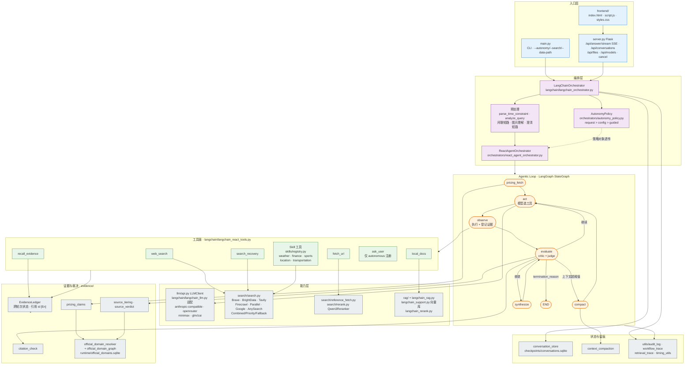
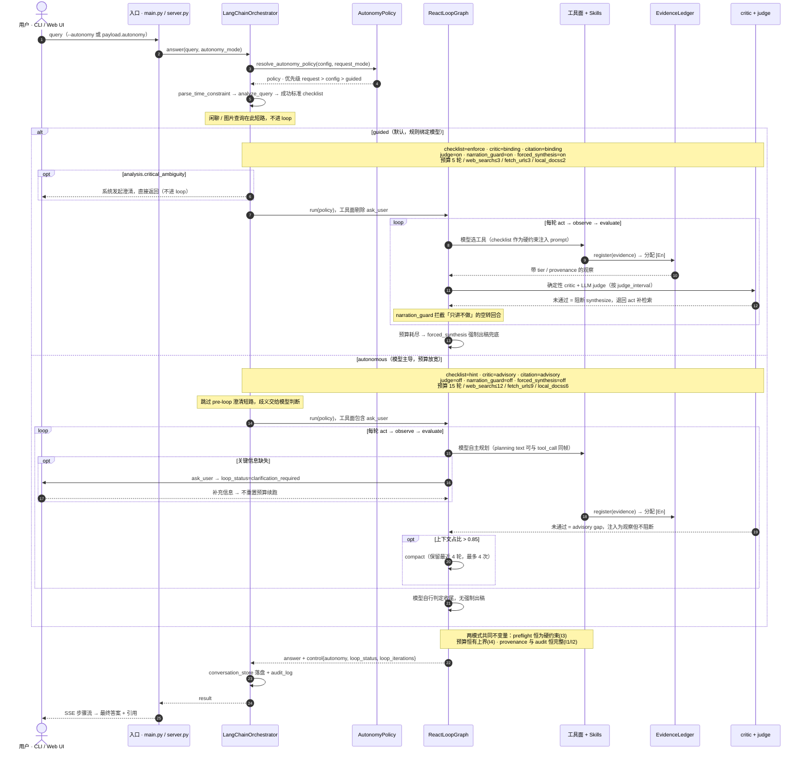

# ISE 项目架构图

## 一、分层架构（组件图）

```mermaid
flowchart TB
    subgraph ENTRY["入口层"]
        CLI["main.py<br/>CLI · --autonomy/--search/--data-path"]
        WEB["server.py Flask<br/>/api/answer/stream SSE · /api/conversations<br/>/api/files · /api/models · cancel"]
        FE["frontend/<br/>index.html · script.js · styles.css"]
    end

    subgraph ORCH["编排层"]
        LCO["LangChainOrchestrator<br/>langchain/langchain_orchestrator.py"]
        AP["AutonomyPolicy<br/>orchestrators/autonomy_policy.py<br/>request &gt; config &gt; guided"]
        PRE["预处理<br/>parse_time_constraint · analyze_query<br/>闲聊短路 · 图片理解 · 澄清短路"]
        RAO["ReactAgentOrchestrator<br/>orchestrators/react_agent_orchestrator.py"]
    end

    subgraph LOOP["Agentic Loop · LangGraph StateGraph"]
        direction LR
        PF(["pricing_fetch"]) --> ACT
        ACT(["act<br/>模型选工具"]) --> OBS(["observe<br/>执行 + 登记证据"])
        OBS --> EVA(["evaluate<br/>critic + judge"])
        EVA -->|继续| ACT
        EVA -->|上下文超阈值| CMP(["compact"]) --> ACT
        EVA -->|收敛| SYN(["synthesize"]) --> EVA
        EVA -->|termination_reason| DONE(["END"])
    end

    subgraph TOOLS["工具面 · langchain/langchain_react_tools.py"]
        T1["web_search"]
        T2["search_recovery"]
        T3["fetch_url"]
        T4["local_docs"]
        T5["recall_evidence"]
        T6["ask_user<br/>仅 autonomous 注册"]
        SK["Skill 工具<br/>skills/registry.py<br/>weather · finance · sports<br/>location · transportation"]
    end

    subgraph INFRA["能力层"]
        LLM["llm/api.py LLMClient<br/>langchain/langchain_llm.py 适配<br/>anthropic-compatible · openrouter<br/>minimax · glm/zai"]
        SRCH["search/search.py<br/>Brave · BrightData · Tavily<br/>Firecrawl · Parallel · Google · AnySearch<br/>Combined/Priority/Fallback"]
        FETCH["search/reference_fetch.py<br/>search/rerank.py Qwen3Reranker"]
        RAG["rag/ + langchain_rag.py<br/>langchain_support.py 向量库<br/>langchain_rerank.py"]
    end

    subgraph EVID["证据与裁决 · evidence/"]
        LED["EvidenceLedger<br/>跨轮次状态 · 引用 id [En]"]
        CIT["citation_check"]
        TIER["source_tiering · source_verdict"]
        ODR["official_domain_resolver<br/>+ official_domain_graph<br/>runtime/official_domains.sqlite"]
        PRC["pricing_claims"]
    end

    subgraph STATE["状态与留痕"]
        CONV["conversation_store<br/>checkpoints/conversations.sqlite"]
        CTX["context_compaction"]
        AUD["utils/audit_log · workflow_trace<br/>retrieval_trace · timing_utils"]
    end

    FE --> WEB
    CLI --> LCO
    WEB --> LCO
    LCO --> AP
    LCO --> PRE
    PRE --> RAO
    AP -.策略对象透传.-> RAO
    RAO --> LOOP

    ACT --> LLM
    OBS --> TOOLS
    T1 & T2 --> SRCH
    T3 --> FETCH
    T4 --> RAG
    T5 --> LED
    SK --> SRCH
    TOOLS --> LED
    LED --> EVID
    EVA --> CIT
    EVA --> TIER
    PF --> PRC
    PRC --> ODR
    TIER --> ODR
    CMP --> CTX
    LOOP --> AUD
    LCO --> CONV
    LCO --> AUD

    classDef entry fill:#e3f2fd,stroke:#1565c0
    classDef orch fill:#f3e5f5,stroke:#6a1b9a
    classDef loop fill:#fff3e0,stroke:#ef6c00
    classDef tool fill:#e8f5e9,stroke:#2e7d32
    classDef infra fill:#eceff1,stroke:#455a64
    class CLI,WEB,FE entry
    class LCO,AP,PRE,RAO orch
    class PF,ACT,OBS,EVA,CMP,SYN,DONE loop
    class T1,T2,T3,T4,T5,T6,SK tool
    class LLM,SRCH,FETCH,RAG,LED,CIT,TIER,ODR,PRC,CONV,CTX,AUD infra
```

## 二、两种 Agent 模式（时序图，alt 分支）

```mermaid
sequenceDiagram
    autonumber
    actor U as 用户 · CLI / Web UI
    participant EP as 入口 · main.py / server.py
    participant OR as LangChainOrchestrator
    participant AP as AutonomyPolicy
    participant LG as ReactLoopGraph
    participant TL as 工具面 + Skills
    participant EL as EvidenceLedger
    participant CR as critic + judge

    U->>EP: query（--autonomy 或 payload.autonomy）
    EP->>OR: answer(query, autonomy_mode)
    OR->>AP: resolve_autonomy_policy(config, request_mode)
    AP-->>OR: policy · 优先级 request > config > guided
    OR->>OR: parse_time_constraint → analyze_query → 成功标准 checklist
    Note over OR: 闲聊 / 图片查询在此短路，不进 loop

    alt guided（默认，规则绑定模型）
        Note over OR,CR: checklist=enforce · critic=binding · citation=binding<br/>judge=on · narration_guard=on · forced_synthesis=on<br/>预算 5 轮 / web_search≤3 / fetch_url≤3 / local_docs≤2

        opt analysis.critical_ambiguity
            OR-->>U: 系统发起澄清，直接返回（不进 loop）
        end

        OR->>LG: run(policy)，工具面剔除 ask_user
        loop 每轮 act → observe → evaluate
            LG->>TL: 模型选工具（checklist 作为硬约束注入 prompt）
            TL->>EL: register(evidence) → 分配 [En]
            EL-->>LG: 带 tier / provenance 的观察
            LG->>CR: 确定性 critic + LLM judge（按 judge_interval）
            CR-->>LG: 未通过 = 阻断 synthesize，退回 act 补检索
            Note over LG: narration_guard 拦截「只讲不做」的空转回合
        end
        LG->>LG: 预算耗尽 → forced_synthesis 强制出稿兜底

    else autonomous（模型主导，预算放宽）
        Note over OR,CR: checklist=hint · critic=advisory · citation=advisory<br/>judge=off · narration_guard=off · forced_synthesis=off<br/>预算 15 轮 / web_search≤12 / fetch_url≤9 / local_docs≤6

        Note over OR: 跳过 pre-loop 澄清短路，歧义交给模型判断
        OR->>LG: run(policy)，工具面包含 ask_user
        loop 每轮 act → observe → evaluate
            LG->>TL: 模型自主规划（planning text 可与 tool_call 同帧）
            opt 关键信息缺失
                LG->>U: ask_user → loop_status=clarification_required
                U-->>LG: 补充信息 → 不重置预算续跑
            end
            TL->>EL: register(evidence) → 分配 [En]
            CR-->>LG: 未通过 = advisory gap，注入为观察但不阻断
            opt 上下文占比 > 0.85
                LG->>LG: compact（保留最近 4 轮，最多 4 次）
            end
        end
        LG->>LG: 模型自行判定收尾，无强制出稿
    end

    Note over LG,TL: 两模式共同不变量：preflight 恒为硬约束(I3)<br/>预算恒有上界(I4) · provenance 与 audit 恒完整(I1/I2)

    LG-->>OR: answer + control{autonomy, loop_status, loop_iterations}
    OR->>OR: conversation_store 落盘 + audit_log
    OR-->>EP: result
    EP-->>U: SSE 步骤流 → 最终答案 + 引用
```
