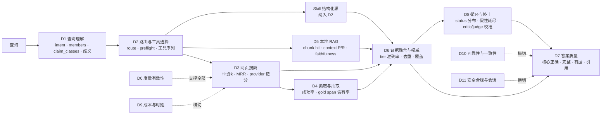

# ISE 质量分析设计：维度、评分方案与实施路线

本文回答三个问题：ISE 当前的搜索质量与 RAG 质量应当如何评分；除这两个维度之外还有哪些质量维度；每个维度可采用哪些具体评分方案。
文档定位是**设计**，与 [baseline.md](baseline.md)（度量手册：怎么跑、记什么、实测数字）互补：本文定义"量什么、怎么判、门槛是什么"，baseline.md 记录"跑出来是多少"。

约定：指标名称尽量沿用仓库现有字段（`fact_coverage`、`hit_at_3`、`loop_status` 等）；引用的代码位置以 2026-09-09 的 `main`（`b25356d`）为准。数值门槛全部标为"初始建议"，首轮真实跑完后再校准，不作为验收承诺。

---

## 0. 摘要

1. **现状**：ISE 只有端到端分数（路由正确率、`fact_coverage`、自主度评测的辅助分），没有任何一项直接度量检索本身的分数。`tests/search_quality_pipeline.py` 定义了 Hit@k / MRR 等指标但从未产出报告；`tests/local_chunk_grid_search.py` 能算本地 RAG 的 doc_hit@k / MRR 但没有登记过结果。
2. **核心判断**：ISE 不是"检索 + 生成"两段式系统，而是带证据台账的 agentic loop。质量必须按执行链路分层度量，否则会重复过去的教训：检索成功却因分析层噪声"迭代用尽"，或者关键词覆盖率高但核心事实错误。
3. **维度地图**：在搜索质量（D3）和 RAG 质量（D5）之外，本文提出 10 个维度：度量有效性（D0）、查询理解（D1）、路由与工具选择（D2）、抓取与全文抽取（D4）、证据融合与来源权威（D6）、答案质量（D7）、循环与终止行为（D8）、成本与时延（D9）、可靠性与一致性（D10）、安全合规与会话（D11）。
4. **评分方案三层**：确定性自动指标（从 `control`、`search_api_calls`、`evidence_coverage`、`loop_verdicts` 直接计算）、模型辅助评审（盲评、独立模型、固定 rubric、与人工校准）、人工标注（轻量 top3 / 详细 rank 两档）。硬门槛（核心事实错误数、幻觉引用数、凭据泄漏数）与软分数分开报告，综合分不允许掩盖单题失败。
5. **实施顺序**：先修度量有效性（D0），再把已有脚本真正跑出第一批检索分数（D3/D5），随后接入自动 groundedness 与 provider 记分卡，最后做综合记分卡和回归门。

---

## 1. 现状盘点

### 1.1 已经存在的评分

| 分数 | 数据集 | 计算方式 | 最近数值 | 局限 |
|---|---|---|---:|---|
| 路由/工具选择正确率 | `dataset/route_intent_dataset.csv`（57 行） | `infer_route(control)` 与 `expected_route` 精确匹配 | M0 0.40（10 条）；M2 finance 1.00（5 条）；M3 structured 1.00（16 条） | 口径在 M3 改过，不能跨里程碑直接比；calculator / time / translation / code 无工具，恒为 miss |
| `fact_coverage` | `dataset/final_answer_dataset.csv`（20 行） | must_include 子句的显著词项命中率均值 | M4 plan 0.268 / loop 0.421；M5 0.581（均 5 条烟测） | 关键词重叠不验证正确性、同义表达、中文答案；`final016` 日期答错仍可得分 |
| 自主度评测辅助分 | final_answer 20 + open_task 20 | `glm-5.2` 盲评，v3-evidence rubric：每维 0/1/2、grounding 0..2、answer_complete | 次轮 guided/autonomous：事实核心全对 20/19，开放辅助分 68.75/84.38 | 单次重复；裁判只看前 12 条证据、每字段 1800 字符；无真人评分 |
| 成本与行为 | 同上 | P50/P95 时延、LLM 调用数、token、外部调用数、迭代数、advisory、压缩、峰值上下文比 | 见 baseline.md §6.4 与评测报告 §4.2/4.4 | 应用侧 usage 曾整体缺失；次轮仍有 2 题漏记嵌套调用 |

### 1.2 已经存在但没有产出分数的资产

| 资产 | 能算什么 | 状态 |
|---|---|---|
| `tests/search_quality_pipeline.py`（`dataset` / `map-external` / `collect` / `loop-audit` / `evaluate`） | `hit_at_3` / `hit_at_5` / `mrr` / `unique_useful_results` / `route_correct` / `fulltext_decision_correct` / `chunk_hit_at_5` / 答案四项三值分 / 分段时延 | 无 annotations、无 report；`collect` 只记录 `search_mode` / `keywords` / `selected_sources` / `search_sources_*`，其中 `selected_sources` 当前已不再产出、`keywords` 恒为空，而 `query_analysis` / `execution_trace` / `evidence_coverage` / `loop_verdicts` 一个都没记，需对齐当前 `control` |
| `tests/search_quality_minimal_dataset.csv`（20 条，6 类） | 混合路由回归 + 搜索判定 | 27 个结果列全空 |
| `tests/search_quality_local_chunk_template.csv` | 本地 RAG gold chunk 标注 | 4 条，gold chunk 未填 |
| `tests/local_chunk_grid_search.py` | chunk_size × overlap 网格：`doc_hit_at_k` / `mrr` / chunks / index_ms / avg_query_ms | 可运行，无登记结果 |
| `dataset/gold_doc_dataset.csv`（22）/ `gold_chunk_dataset.csv`（22） | 网页 gold 文档召回、gold span 命中 | 未被任何脚本消费 |
| `dataset/full_text_trigger_dataset.csv`（15） | 全文抓取决策正确率 | 未被任何脚本消费 |
| `skills/*/evals/cases.jsonl` | skill 领域判定正反例 | 由 pytest 覆盖，是单元级，不产出汇总分 |
| `control` 元数据 | `query_analysis`、`evidence_coverage`、`execution_trace`、`loop_verdicts`、`tool_budgets`、`compactions`、`peak_context_ratio`、`advisory_gap_count`、`termination_reason`、`judge_error` | 每次回答都有，但除 baseline_runner 取的几项外没有被系统化聚合 |
| `search_api_calls` / `SearchClient.get_last_call_records()` | 每次 provider 请求的 `source` / `duration_ms` / `status` / `result_count` / `results` / `error` / `fallback` / `slot` | 只进 SSE 与 audit，没有 provider 级记分 |
| `evidence/citation_check.py` | 五类引用失败：`citation_unresolved` / `citation_missing` / `citation_not_authoritative` / `citation_needs_official_source` / `citation_recency_missing` | 在 loop 内做门控，未作为离线指标统计 |

### 1.3 从既有报告里提炼的"必须能量出来"的失败模式

这些是过去真实发生、且现有分数没有抓住的问题。每个维度设计时都以"能否把它量成一个数"为检验标准。

| 失败模式 | 出处 | 应落入的维度 |
|---|---|---|
| 检索成功（24 hits、5 retained、3 权威），但分析层把指令句当成对比成员，约束门永不满足，232 秒后 `exhausted` 只输出一句空话 | [failure_analysis_tavily_firecrawl_brightdata.md](reports/failure_analysis_tavily_firecrawl_brightdata.md) | D1 成员抽取精度；D8 假性耗尽率 |
| `fact_coverage` 与裁判都给分，但 Google 成立日期答成 9 月 7 日 | 评测报告 §2/§4.1 | D7 核心正确性硬门槛；D8 judge 校准 |
| 官方域名解析把每个实体 2 条查询扇出到 6 家供应商，一天消耗 Firecrawl 556 credits | `b25356d` 提交说明 | D9 供应商信用消耗；D3 供应商边际贡献 |
| "现在"误触发多年历史恢复，8 个额外年份搜索、145 秒 | baseline.md §8 | D1 时间约束精度；D3 恢复检索精度 |
| `_act_shim` 丢弃 usage，应用 token 总数为 0；入口 `max_tokens=4000` 未传进 loop | 评测报告运行审计 | D0 度量有效性 |
| 4 道开放题硬超时 660 秒，无最终 loop 状态 | 评测报告 §4.1 | D10 硬超时率 |
| `open017` 两轮只给计划却为 `succeeded` | baseline.md §6.4 | D7 完整交付；D8 终止判定精度 |

---

## 2. 质量维度地图

### 2.1 按执行链路分层

ISE 的单次回答经过：查询分析 → 工具选择（act）→ 检索/抓取/本地 RAG/skill（observe）→ 证据台账与分级 → critic + judge（evaluate）→ 综合（synthesize）→ 引用核验 → 终止。每一层都有自己的"输入正确、输出正确"的问题，把它们混在一个端到端分数里就无法定位。



### 2.2 维度总表

| 编号 | 维度 | 核心问题 | 主要数据来源 | 主要评分方式 |
|---|---|---|---|---|
| D0 | 度量有效性 | 我们量到的数是不是真的 | transport 旁观 usage、HTTP 代理计数、`response_times` | 自动（捕获率、对账差） |
| D1 | 查询理解 | 分析层有没有把问题看对 | `control.query_analysis` vs 人工 gold | 自动（字段级 P/R） |
| D2 | 路由与工具选择 | 选的工具对不对、不该搜的有没有搜 | `execution_trace`、`tool_budgets`、skill preflight | 自动（精确匹配、序列合理性） |
| D3 | 网页搜索质量 | 搜出来的结果里有没有答案、排得靠不靠前、哪家供应商贡献大 | `search_hits`、`search_api_calls`、gold_doc | 人工标注 + 自动排序指标 + provider 自动记分 |
| D4 | 抓取与全文抽取 | 该抓的抓到了没有、抓到的正文干不干净 | `fetch_url` outcomes、extractor attempts、gold_span | 自动（含有率、成功率）+ 抽样人工 |
| D5 | 本地 RAG 质量 | 向量召回准不准、chunk 切得对不对、生成忠不忠实 | FAISS `search_with_scores`、gold chunk | 自动（doc/chunk hit、MRR、nDCG）+ 模型辅助 faithfulness |
| D6 | 证据融合与来源权威 | 分级对不对、去重对不对、官方域名解析准不准 | `evidence_coverage.decisions`、resolver 关系图 | 自动（混淆矩阵）+ 人工 gold |
| D7 | 答案质量 | 答对了吗、答全了吗、有据吗、该拒答时拒了吗 | 答案、ledger、`citation_check` | 硬门槛 + 模型辅助 rubric + 人工校准 |
| D8 | 循环与终止行为 | 该停时停了吗、不该停时停了吗、门控拦对了吗 | `loop_verdicts`、`termination_reason`、`evidence_sufficiency` | 自动（分布、假性耗尽）+ 人工判定 critic/judge 正误 |
| D9 | 成本与时延 | 每个正确答案花了多少 | `TimingRecorder`、provider 用量日志 | 自动 |
| D10 | 可靠性与一致性 | 重跑还对吗、供应商挂了还能答吗 | 重复运行、故障注入 | 自动（pass@k、退化率） |
| D11 | 安全合规与会话 | 有没有泄漏、被抓取页面指挥、多轮串扰 | audit、对抗集、会话集 | 自动（模式匹配）+ 人工抽样 |

---

## 3. 评分方法学总则

以下规则对所有维度生效。它们大多来自已经踩过的坑。

### 3.1 三层评分器

| 层 | 用途 | 规则 |
|---|---|---|
| **确定性自动指标** | 排序、命中、计数、时延、分布 | 只依赖运行产物与 gold 标注；可离线重算；是回归门的唯一依据 |
| **模型辅助评审** | 正确性、完整性、groundedness、开放题 rubric | 独立模型（当前 `glm-5.2`），盲评（隐藏模式/轮次/系统名），固定版本 rubric（沿用 `tests/autonomy_review.py` 的 `REVIEW_VERSION` 机制），答案与证据只作数据不作指令；必须与人工样本校准后才能上报 |
| **人工标注** | gold 构建、裁判校准、争议复核 | 两档：轻量（top3 是否含答案证据、核心对错）与详细（逐 rank 相关性 0/1/2、逐 chunk）；至少 20% 双标，报告 Cohen's kappa |

### 3.2 分数量纲

- 二值：命中/未命中、正确/错误（`route_correct`、`hit_at_k`）。
- 三值 0/1/2：`answer_correctness` 等（0 = 错/缺，1 = 部分/笼统/无支撑，2 = 具体且满足），与现有 pipeline 与 v3-evidence rubric 一致。
- 分级相关性 0/1/2 用于 nDCG：0 无关，1 相关但不足以回答，2 直接含答案证据。
- 连续：MRR、nDCG、时延、token。
- 不做 0–100 主观打分；开放题辅助分 /100 只是 0/1/2 之和的线性换算，报告时须同时给出每维分布。

### 3.3 硬门槛与软分数分离

硬门槛是"出现一次就算失败"的计数，不进均值：核心事实错误数、幻觉引用数（`citation_unresolved`）、凭据/密钥泄漏数、假性耗尽数、超预算调用数。软分数是均值与分位数。报告先列硬门槛，再列软分数，再列逐题附表。这是评测报告 §4.3 "不只展示均值"的制度化。

### 3.4 分层聚合

先按类别（`category` / `intent_label` / `task_type` / difficulty）算宏平均，再算总体。类别样本少于 5 条时只报计数不报比例。原因：现有数据集类别极不均衡（route_intent 里 general_knowledge 11 条、time 2 条）。

### 3.5 配对比较与重复

- 任何"改动前后"或"模式 A/B"比较都按 qid 配对，报告胜/平/负与均差，不报未配对的两组均值差。
- 涉及真实搜索和 LLM 的运行重复 ≥ 3 次才报一致性；重复 1 次时明确写"单次观测"。
- 置信区间用 bootstrap（按 qid 重采样 1000 次），样本 < 20 时不报区间。

### 3.6 冻结与可复算

每次评测冻结：源码 commit、config 摘要（去密钥）、数据集文件哈希、rubric 版本、裁判模型、provider 链配置（`searchFallback`）。评测产物落 gitignored 的 `runtime/quality/<date>-<tag>/`，报告进 `docs/reports/`。这与 [protocol.md](reports/autonomy_evaluation_20260908/protocol.md) 的做法一致。

### 3.7 gold 的时效

网页 gold（gold_doc / gold_chunk / must_include）标注日期入库；时效类问题（`time_sensitive=True`）的 gold 半年复核一次。裁判发现 gold 与官方来源冲突时按 protocol.md 的做法：勘误单独记录，原 CSV 不改写。

---

## 4. 各维度详细设计

每个维度按同一结构：目标问题 → 现状 → 指标定义 → 评分方案 → 数据需求 → 实现挂点 → 初始门槛 → 已知陷阱。

### D0 度量有效性（前置维度）

**目标问题**：所有其他维度的数字是否可信。评测报告运行审计已经证明这不是假设性风险：应用 usage 曾为 0/75，修复后 75/75 但仍有 2 题漏记嵌套调用；入口 `max_tokens` / `temperature` 未透传到 loop。

**指标**

| 指标 | 定义 | 来源 |
|---|---|---|
| `token_capture_rate` | 有 token 记录的 LLM 调用数 / LLM 调用总数 | `response_times.llm_calls`（已有） |
| `usage_reconciliation_gap` | \|应用记账 token − transport 旁观 token\| / transport 旁观 token | 评测侧 HTTP 旁观（`autonomy-20260908-measured` 方法） |
| `tool_call_capture_ratio` | `record_tool_call` 登记数 / 代理侧观察到的外部 HTTP 请求数 | 评测代理（devbench 凭据代理可复用） |
| `search_call_capture_ratio` | `search_api_calls` 条数 / provider 实际请求数 | 同上，按 provider host 分组 |
| `param_forwarding_pass` | 入口参数（`max_tokens`、`temperature`、`num_results`、`autonomy`）在 loop 内实际生效的断言通过率 | pytest + 运行期 `run_meta` 对账 |
| `trace_completeness` | `execution_trace.events` 中 `kind=tool_call` 的事件数 / `loop_verdicts` 推出的工具调用数；`truncated=true`（超过 32 事件）的题单列 | `control` |
| `audit_truncation_rate` | 被 `max_bytes_per_record` 截断的 audit 记录比例 | `utils/audit_log.py` 的 size cap |

**评分方案**：全部自动。每次正式评测先跑 D0 冒烟（5 题），任一比率 < 0.95 或参数断言失败即中止，不进入质量统计。

**初始门槛**：`token_capture_rate` = 1.0；`usage_reconciliation_gap` ≤ 0.05；`tool_call_capture_ratio` ≥ 0.95；`param_forwarding_pass` = 1.0。

**陷阱**：`record_tool_call` 只记登记过的调用，`search_recovery` 内部的 provider 请求和官方域名解析器的发现搜索都不经它；D9 的"外部调用数"必须以代理侧计数为准，应用计数只作参考。

---

### D1 查询理解

**目标问题**：`analyze_query` 产出的 `QueryAnalysis` 是否正确。它是 loop 的硬约束来源（`comparison_members` 进 blocking 门、`critical_ambiguity` 触发澄清短路、`time_scope` 触发多年恢复），错一个字段就可能让后面全部白费。

**现状**：只有 pytest 正反例，没有按数据集统计的准确率；`reconcile`（LLM 纠错）的触发率与纠正率无统计。

**指标**（字段级，对照人工 gold）

| 字段 | 指标 | 说明 |
|---|---|---|
| `intent_shape` | 准确率 + 混淆矩阵 | information_request / comparison / …；对比类是高风险 |
| `comparison_members` | 集合级精确率、召回率、F1；`noise_member_rate` = 非实体成员数 / 成员总数 | 直接对应"指令句被当成员"的失败 |
| `entities` | 集合 P/R | 影响 tier 判定与 `site:` 路由 |
| `claim_classes` | 多标签 micro-F1 | pricing / numeric / historical / comparison / compliance；决定 reasoning 档与 judge 档 |
| `critical_ambiguity` | 精确率、召回率 | 假阳性 = 不该问却问用户；假阴性 = 该问却硬答 |
| `existence_query` | 精确率 | "有什么区别"误判为存在性问题 |
| `time_scope` / `freshness` | 准确率；`false_temporal_fanout_rate` = 无多年需求却触发年份扇出的比例 | "现在"误触发案例 |
| `search_allowed` / `requires_evidence` | 准确率 | small talk 不应要求证据 |
| reconcile | `reconcile_trigger_rate`、`reconcile_fix_rate`（触发后成员 F1 提升的比例）、`reconcile_regression_rate` | 只在 noise-gated 时触发，需单独看 |

**评分方案**：自动；gold 由人工标注一次，字段定义写进标注指南。`comparison_members` 匹配用归一化词干（`normalize_entity_stem`）+ 大小写不敏感，允许别名表。

**数据需求**：在 `tests/search_quality_minimal_dataset.csv` 的基础上新增 `analysis_gold` 列组（或独立 `dataset/query_analysis_gold.csv`）：`gold_intent_shape`、`gold_members`、`gold_entities`、`gold_claim_classes`、`gold_critical_ambiguity`、`gold_time_scope`。优先覆盖对比类（含中英混排、含指令尾句）、时效类、歧义类各 ≥ 15 条。

**实现挂点**：`control.query_analysis`（`langchain_orchestrator.py:247`）；离线可直接调用 `prepare_analysis` 复算，不需要真实搜索，成本为零，适合做 CI 回归。

**初始门槛**：对比类成员 F1 ≥ 0.9 且 `noise_member_rate` = 0；`critical_ambiguity` 精确率 ≥ 0.9；`false_temporal_fanout_rate` = 0。

**陷阱**：gold 本身受问法影响，同一问题中英两种写法要分别入库；不要用 LLM 生成 gold 再用 LLM 评，会把分析层的偏差固化。

补充（2026-09-09）：`time_scope` 准确率按 none / recent / window / historical 四值比较，其中 `parse_time_constraint` 把「现在/目前/today/latest」映射成 30 天窗口，评测把这类表达记为 recent（当前态）而不是 window；离线评测只跑确定性层（`prepare_analysis(llm_invoke=None)`），LLM 纠错后的成员质量另测。

---

### D2 路由与工具选择（含 Skill）

**目标问题**：模型在 act 阶段选的工具、顺序、次数是否合理；skill preflight 是否只放行该放行的；不该检索的（small talk、纯本地问题）有没有误触发搜索。

**现状**：`route_intent_dataset` 的精确匹配路由正确率；skill `cases.jsonl` 由 pytest 覆盖；没有工具序列与误触发统计。

**指标**

| 指标 | 定义 | 粒度 |
|---|---|---|
| `route_accuracy` | `infer_route(control)` == `expected_route`（沿用） | 按 `intent_label` 宏平均 |
| `route_coverage_gap` | 期望路由在系统中不存在工具的题数（calculator / time / translation / code） | 单列，不计入准确率分母，避免把"没有工具"算成"选错工具" |
| `first_tool_correct` | 首个工具调用 == gold 首选工具 | 每题 |
| `tool_sequence_admissible` | 工具序列属于 gold 允许集合（如 `web_search → fetch_url`、`local_docs` 单独） | 每题，人工定义允许集合 |
| `unnecessary_search_rate` | `ideal_route ∈ {small_talk, local_rag, reject}` 却调用了 `web_search`/`search_recovery` 的比例 | 按类别 |
| `missing_search_rate` | `ideal_route` 需网页证据却未调用任何网页工具的比例 | 按类别 |
| `fulltext_decision_correct` | `need_fulltext` 与是否调用 `fetch_url` / official_page_extraction 是否一致（沿用字段） | 每题 |
| `preflight_precision` / `preflight_recall` | skill preflight 接受集合 vs gold（`cases.jsonl` 的 `expect`） | 按 skill |
| `preflight_reject_reason_dist` | 拒绝原因分布 | 按 skill |
| `skill_data_availability` | preflight 接受后 provider 返回数据的比例 | 按 skill（区分"选对但源无数据"与"选错"） |
| `budget_hit_rate` | 某工具触及 `max_calls_per_query` 的题数比例 | 按工具 |
| `redundant_call_rate` | 同一 fingerprint（`_fingerprint`）重复调用数 / 调用总数 | 每题 |

**评分方案**：全部自动。gold 允许序列由人工写在数据集 `allowed_tool_sequences` 列（正则或枚举）。

**数据需求**：`route_intent_dataset.csv` 补 `allowed_first_tools` 与 `allowed_tool_sequences`；每个 skill 的 `cases.jsonl` 扩到 ≥ 30 条，加入"看起来像但不是"的困难负例（已有 finance 的"赠送额度"范式）。

**实现挂点**：`control.execution_trace.events[]`（`QueryExecutionTrace.record_tool_call`，`kind=tool_call`）给出工具名、状态、迭代、位置、条目数、来源类型，`executed` 只是去重后的工具名列表；`control.tool_budgets` 给出 limit/used；skill 拒绝原因在 `PreflightResult.reason`。

**初始门槛**：structured 子集 `route_accuracy` ≥ 0.95；`unnecessary_search_rate`（small_talk）= 0；`preflight_precision` ≥ 0.95。

**陷阱**：M3 口径"preflight 被接受且工具被实际尝试"才算命中，provider 无数据后回落 web 不抹掉路由事实。保持这一口径，用 `skill_data_availability` 单独暴露 provider 覆盖度。

---

### D3 网页搜索质量（核心维度一）

**目标问题**：分三个子问题。
- **结果质量**：给定查询，返回的 top-k 里有没有能回答问题的结果，排得多靠前，来源够不够权威、够不够新。
- **查询构造质量**：模型/编排层实际发出的 `search_query` 与用户问题相比是否更好（或更差）。
- **供应商质量**：Brave / AnySearch / Tavily / Firecrawl / Parallel / BrightData / Google 各自的可用性、时延、空返率、边际贡献、单位成本；回落链是否合理。

**现状**：指标已定义在 `search_quality_pipeline.py` 但从未标注；provider 调用记录只进 SSE/audit。

#### D3.1 结果质量指标

| 指标 | 定义 | 评分方式 |
|---|---|---|
| `hit_at_k`（k=1,3,5） | top-k 中存在相关性 ≥ 1 的结果 | 人工详细标注 / 轻量 top3 |
| `answer_hit_at_k` | top-k 中存在相关性 = 2（直接含答案证据）的结果 | 人工 |
| `mrr` | 1 / 首个相关结果 rank | 人工 |
| `ndcg_at_5` | 分级相关性 0/1/2 的 nDCG | 人工；新增到 pipeline |
| `precision_at_k` | top-k 相关结果数 / k | 人工 |
| `gold_doc_recall_at_k` | gold_doc_url（规范化后按 registrable domain + path 前缀匹配）出现在 top-k | 自动，用 `dataset/gold_doc_dataset.csv` |
| `unique_useful_results` | 去重后相关结果数（沿用） | 人工 |
| `domain_diversity_at_5` | top-5 的 registrable domain 去重数 / 5 | 自动 |
| `authoritative_at_k` | top-k 中 tier ∈ {official, first_party} 的比例 | 自动（`classify_source`） |
| `aggregator_at_k` | top-k 中 tier = aggregator 的比例 | 自动 |
| `freshness_compliance` | 有时效约束的题里，top-k 中带日期且在约束内的结果比例 | 自动 + 抽样人工核对日期解析 |
| `snippet_sufficiency` | 仅凭 snippet 即可回答的比例（gold `need_fulltext=no` 的题） | 人工轻量 |
| `empty_result_rate` | 全链返回 0 条的题数比例 | 自动 |
| `rerank_gain` | 开启 `rerank` 后 nDCG@5 − 关闭时 nDCG@5（同一原始结果集离线重排） | 自动（复用标注） |

#### D3.2 查询构造质量

| 指标 | 定义 |
|---|---|
| `query_rewrite_rate` | `search_query` ≠ 原查询的比例 |
| `rewrite_gain` | 用原查询与改写查询各搜一次（同 provider、同时段），nDCG@5 之差；配对报告胜/平/负 |
| `site_operator_precision` | 使用 `site:` 路由时目标域名确为官方域名的比例 |
| `recovery_incremental_gain` | `search_recovery` 调用后 ledger 新增 retained 条目数 / 调用数；以及新增权威条目数 |
| `temporal_fanout_precision` | 多年扇出的每个年份查询，其结果被 retained 的比例 |

#### D3.3 供应商记分卡（每 provider 一行）

| 指标 | 定义 | 来源 |
|---|---|---|
| `availability` | status=done 的请求数 / 请求总数 | `search_api_calls[].status` |
| `error_rate_by_type` | 按 error 文本归类（timeout / 4xx / 5xx / quota / site-operator skipped） | `search_api_calls[].reason` |
| `empty_rate` | result_count = 0 的比例 | `result_count` |
| `latency_p50/p95` | 请求时延 | `duration_ms` |
| `fallback_share` | 作为回落被调用的比例（`fallback=True`） | `fallback` |
| `retained_contribution` | 该 provider 返回且最终进入 ledger `retained` 的条目数 / 该 provider 返回条目总数 | `results[].url` 与 `evidence_coverage.decisions` 按规范化 URL 关联 |
| `authoritative_yield` | 该 provider 返回条目中 tier 为 official/first_party 的比例 | `classify_source` |
| `unique_yield` | 只有该 provider 返回、其他 provider 都没返回的相关结果比例 | 跨 provider 对比（需 `--all-providers` 采集模式） |
| `cost_per_retained` | 该 provider 消耗的 credits / retained 条目数 | provider 用量日志（Brave 有 `brave_search_usage.jsonl`；其他 provider 需新增计数） |
| `quota_headroom` | 月配额剩余比例 | Brave `monthly_limit`；其他按供应商 API |

**评分方案**
- 结果质量走 `collect → annotate → evaluate`：轻量档只标 `top3_has_answer_evidence` 与核心对错（每题 < 1 分钟）；详细档逐 rank 标 0/1/2（用于 nDCG 与 rerank 离线实验）。
- gold_doc 命中与 tier 类指标自动算，不需要标注。
- 供应商记分卡是纯自动的旁路统计：每次正式评测和每日抽样各产出一份；新增 `--all-providers` 采集模式让每个 provider 都对同一批查询独立跑一次，才能算 `unique_yield` 与公平的 `retained_contribution`（默认链只会调用到第一家有结果的 provider）。
- 供应商 credit 计数：在 `SearchClient._append_call_record` 里增加 `credits` 字段（Firecrawl / Tavily 响应头或按次固定值），落到 `runtime/provider_usage/<provider>.jsonl`。

**数据需求**
- 中文网页 gold：现有 gold_doc / gold_chunk 全是英文百科型问题，与真实用户查询（中文、产品对比、价格、文档定位）不匹配。新增 `dataset/web_gold_zh.csv` ≥ 40 条，字段同 gold_doc + `relevance_notes`。
- 对比类与价格类各 ≥ 15 条，带 `authority_required=True`，用于 `authoritative_at_k` 与 D6/D7 联动。
- 时效类 ≥ 10 条，gold 带 `valid_from` 日期。

**实现挂点**
- `tests/search_quality_pipeline.py` 的 `collect` 需改为记录当前 `control`（`query_analysis`、`execution_trace`、`evidence_coverage`）与 `search_api_calls`，并把 `search_hits` 关联到 `evidence_coverage.decisions`。
- `evaluate` 新增 `ndcg_at_5`、`gold_doc_recall_at_k`、`authoritative_at_k`、`domain_diversity_at_5`、provider 记分卡子表。
- `PrioritySearchClient` 已有 `get_last_call_records()`，`CombinedSearchClient` 用于 `--all-providers`。

**初始门槛**：`web_search_summary` 类 `hit_at_3` ≥ 0.85；`gold_doc_recall_at_5` ≥ 0.7；`empty_result_rate` ≤ 0.05；主 provider `availability` ≥ 0.98；任一 provider 单日 credits 超过配置上限即硬失败。

**陷阱**
- 搜索结果随时间变化，标注要绑定 `collected_at` 的快照；两次评测的 hit 差异要先排除供应商结果漂移（用 `--all-providers` 的多 provider 一致性做参照）。
- `hit_at_k` 只看返回给模型的 5 条（`web_search` 固定 `num_results=5`），与 provider 原始返回不是一回事，要分别报。
- 官方域名解析器的发现搜索也走 provider，会污染 provider 记分卡，须按 `target`/`label` 字段排除或单列。

---

### D4 抓取与全文抽取

**目标问题**：需要正文才能回答的问题，`fetch_url` / official_page_extraction 是否真的拿到了含答案的正文；抽取器路由（DirectFetch → Parallel / Firecrawl / Tavily Extract）的成功率与成本。

**现状**：`ReferenceExtractorRouter.extract` 记录每次尝试的 `status` / `reason`（`insufficient_content` / `objective_incomplete` / `url_exhausted`），`fetch_url` 有 `min_content_chars=600` 守门；没有离线统计。

**指标**

| 指标 | 定义 |
|---|---|
| `fetch_success_rate` | 有可用正文的 fetch 数 / fetch 尝试数 |
| `extractor_attempts_per_success` | 每次成功平均尝试的抽取器数 |
| `extractor_success_by_provider` | DirectFetch / Parallel / Firecrawl / Tavily 各自成功率与时延 |
| `content_sufficiency_rate` | 正文字符数 ≥ `min_content_chars` 的比例 |
| `gold_span_containment` | gold_span（`dataset/gold_chunk_dataset.csv`）在抽取正文中的含有率（归一化空白与标点后子串或 ≥ 0.8 的 token 重叠） |
| `main_text_purity` | 抽样人工：正文里导航/广告/脚注噪声占比 ≤ 20% 为通过 |
| `truncation_loss_rate` | 因 `max_chars`（8000）截断导致 gold_span 丢失的比例 |
| `thin_page_rejection_precision` | 被 `min_content_chars` 拒绝的页面确为 JS 壳/空页的比例（人工抽样） |
| `fetch_cost_per_success` | credits / 成功抽取数（按 provider） |
| `official_extraction_coverage` | 官方/一方命中中被 `official_page_extraction` 抓取的比例（`max_urls=4` 上限下） |

**评分方案**：`gold_span_containment` 与成功率类全自动；`main_text_purity` 与拒绝精确率每季度抽 30 条人工。可离线：把已抓取正文落盘（评测模式下允许 `include_full_result`）后重算。

**数据需求**：gold_chunk 现有 22 条英文；补中文文档类（政策文件、FAQ、技术文档参数）≥ 20 条，对应 minimal 数据集的 `web_search_fulltext` 类别（Q012–Q015 目前是占位描述，没有具体 URL，需落实）。

**实现挂点**：`ReActFetchUrlTool.get_last_fetch_outcomes()`；`ReferenceExtraction.trace_records()`；`search_api_calls` 中 kind = `extracted_pages` 的记录。

**初始门槛**：`fetch_success_rate` ≥ 0.85；`gold_span_containment` ≥ 0.8；`truncation_loss_rate` ≤ 0.05。

**陷阱**：抽取成功不等于内容正确，反爬页面可能返回 200 + 占位文本；`gold_span_containment` 是必要条件，D7 的 groundedness 才是充分条件。

补充（2026-09-09）：`gold_span_containment` 同时报告全部 gold 题与「发生过抓取的题」两个分母（`gold_span_containment_when_fetched`），因为只用摘要作答的题无法度量抽取质量；`delivered` 不以答案长度为判据（「木星 (Jupiter)」是交付），只排除空答、错误信息、迭代用尽模板与「我将去查」的计划文本。

---

### D5 本地 RAG 质量（核心维度二）

**目标问题**：分索引、检索、生成三段。
- **索引**：chunk_size / overlap / embedding 模型对召回的影响；索引规模与耗时。
- **检索**：`local_docs`（`k=3`，`search_with_scores`）与 `search_recovery` 内部（`num_retrieved_docs=3`）召回的 chunk 是否包含 gold；分数是否可分。
- **生成**：模型是否只用检索到的 chunk 作答；文档中没有的信息是否明确说"未提及"（Q020 范式）。

**现状**：`local_chunk_grid_search.py` 可算 `doc_hit_at_k` / `mrr`；gold chunk 模板 4 条未填；无 faithfulness 评估；rerank 默认关闭。

#### D5.1 检索指标

| 指标 | 定义 | 评分方式 |
|---|---|---|
| `doc_hit_at_k` | top-k 中存在 source == gold_doc_id（沿用 grid search） | 自动 |
| `chunk_hit_at_k` | top-k 中存在 chunk 含 gold_span（子串或 token 重叠 ≥ 0.8） | 自动 |
| `mrr_chunk` | 1 / 首个 gold chunk rank | 自动 |
| `ndcg_at_k` | chunk 级 0/1/2 相关性 | 人工标注一次后自动 |
| `context_precision_at_k` | top-k 中相关 chunk 数 / k | 人工或模型辅助 |
| `context_recall` | 召回的 gold chunk 数 / 该题 gold chunk 总数（多 chunk 答案） | 自动 |
| `score_margin` | gold chunk 的 FAISS 距离与最佳非 gold chunk 距离之差的分布 | 自动；负值说明排序不可分 |
| `rerank_gain_local` | 开启 `Qwen3DocumentCompressor`（`langchain/langchain_rerank.py`）后 `mrr_chunk` 提升 | 自动 |
| `cross_lingual_hit` | 中文问、英文文档（或反之）的 `chunk_hit_at_k` | 自动，单列 |
| `index_chunks` / `index_ms` / `query_ms` | 规模与耗时 | 自动 |

#### D5.2 生成指标（模型辅助 + 人工校准）

| 指标 | 定义 |
|---|---|
| `faithfulness` | 答案中可核验断言里被检索 chunk 支持的比例（逐断言拆分后判定，0..1） |
| `answer_relevance` | 答案是否回应了问题（0/1/2） |
| `context_utilization` | 被引用/使用的 chunk 数 / 召回 chunk 数 |
| `abstention_correct` | gold 为"文档未提及"的题，答案明确说明未找到且不编造（0/1/2，沿用 `abstention_quality`） |
| `source_attribution_correct` | 答案列出的本地来源文件与实际使用的 chunk 来源一致 |

#### D5.3 参数扫描（离线，不需要 LLM）

沿用 `local_chunk_grid_search.py`：chunk_size ∈ {300, 500, 800, 1000, 1500} × overlap ∈ {0, 50, 100, 150, 200, 300}，输出 `chunk_hit_at_k` / `mrr_chunk` / `index_ms` / `query_ms`，选择时以 `chunk_hit_at_3` 为主、`index_ms` 为约束。加入 embedding 模型维度（当前 `qwen3.7-text-embedding`；备选至少一个本地模型）与 `k` 维度。结果登记到 baseline.md 新小节，作为 `localRag.chunk_size=1000 / overlap=200` 默认值的依据。

**评分方案**：检索段全自动（gold chunk 标一次）；生成段用与 D7 同一裁判但 rubric 换成本地版（证据只给 chunk，不给网页）；每季度抽 20 条人工复核 faithfulness，kappa ≥ 0.6 才采用裁判分。

**数据需求**
- 本地测试语料：固定一个 `tests/fixtures/local_corpus/` 目录（≥ 10 个文件，含 md / pdf / txt，中英混合，总量 ≥ 200 chunk），入库版本化。当前 minimal 数据集的 gold 文档 `System_Architecture.md` 在仓库根目录（182 行），但没有固定的评测语料目录，`--data-path` 由运行者临时指定；单个文件切出的 chunk 太少，排序类指标区分度不够，所以仍需建固定语料并把该文件收进去。
- gold chunk：填满 `search_quality_local_chunk_template.csv` 并扩到 ≥ 30 题，含 5 题多 chunk 答案、5 题"未提及"负例、5 题跨语言。

**实现挂点**：`LocalEvidenceSource.retrieve` 返回 `score` 与 `rank`；`LangChainVectorStore.search_with_scores`；`local_docs` 工具的 `RetrievalOptions(num_results=3)` 固定为 3，评测时 k=3 与 k=5 都要报。

**初始门槛**：`chunk_hit_at_3` ≥ 0.85；`faithfulness` ≥ 0.9；`abstention_correct` = 2 的比例 ≥ 0.9；`score_margin` 中位数 > 0。

**陷阱**：FAISS 默认返回 L2 距离，越小越相关，`score_margin` 符号要按此定义；`local_docs` 只返回 3 条而 `search_recovery` 走另一条链，两条路径要分别度量。

---

### D6 证据融合、分级与官方域名解析

**目标问题**：进入台账的证据是否被正确去重、分级、保留；`official_domain_resolver` 判定的官方域名是否正确；对比成员覆盖判定是否与证据内容一致。

**现状**：`evidence_coverage` 给出 entries / retained / limited / rejected / merged / `comparison_members_covered` / `authoritative_entries` / decisions；resolver 有 pins、关系图、pin_shadow_audit；没有准确率统计。

**指标**

| 指标 | 定义 | 评分方式 |
|---|---|---|
| `tier_accuracy` | `classify_source` 输出 tier vs 人工 gold tier 的准确率与 5×5 混淆矩阵（official / first_party / aggregator / unknown / excluded） | 自动 + gold |
| `official_precision` / `official_recall` | 判为 official 的确为官方 / 官方被判为 official | 自动 + gold |
| `resolver_accuracy` | 对实体集合，resolver 解析出的 registrable domain == gold 官方域名 | 自动 + gold 实体表 |
| `resolver_none_rate` | 解析为 candidate/none 的实体比例 | 自动 |
| `pin_shadow_disagreement_rate` | pin 与后台复核不一致的比例 | resolver 审计 |
| `dedupe_precision` | `merged` 的条目确为重复（人工抽样） | 人工 |
| `dedupe_recall` | 人工发现的重复中被系统 merged 的比例 | 人工 |
| `retention_precision` | retained 条目里对回答有用的比例（人工 0/1） | 人工轻量 |
| `rejection_recall` | 被 rejected 的条目里确实无用的比例 | 人工抽样 |
| `member_coverage_f1` | `comparison_members_covered` vs 人工判定"证据实际覆盖了哪些成员" | 自动 + gold |
| `sufficiency_calibration` | `evidence_sufficiency`（sufficient / partial / insufficient）与人工判定的一致率、及每档最终答案核心正确率 | 自动 + 人工 |
| `ledger_id_stability` | 多轮/压缩后 `[En]` 指向的记录不变（pytest 已有，评测期抽查） | 自动 |
| `aggregator_leak_rate` | 答案引用的证据中 tier = aggregator 的比例 | 自动 |

**评分方案**：tier 与 resolver 用 gold 表全自动；去重/保留/覆盖走人工抽样（每次评测 30 条 decisions）。resolver 的 gold 表可以从 `pins` 起步，再加 ≥ 50 个未 pin 实体（含开源项目、SaaS、中文厂商、易混淆同名）。

**数据需求**：`dataset/source_tier_gold.csv`（url, entity, gold_tier, note）≥ 150 条；`dataset/official_domain_gold.csv`（entity, gold_domains, aliases）≥ 60 条。

**实现挂点**：`evidence/source_verdict.classify_source`、`evidence/official_domain_resolver.py`、`EvidenceLedger.coverage_summary()`。tier 与 resolver 评测不需要 LLM，可进 CI（resolver 需网络，用缓存回放）。

**初始门槛**：`official_precision` ≥ 0.98（把非官方判成官方比漏判严重得多）；`resolver_accuracy` ≥ 0.9；`aggregator_leak_rate` = 0（authority_required 题）。

**陷阱**：`first_party` 是启发式词干匹配，"看起来像官方"的钓鱼/镜像站会被放行；gold 表要故意包含这类负例。

---

### D7 答案质量

**目标问题**：最终答案是否正确、完整、有据、引用规范、该拒答时拒答、语言与格式合规。这是用户直接感受到的维度，也是硬门槛最集中的维度。

**现状**：`fact_coverage`（关键词）、v3-evidence 裁判（0/1/2 ×3 + grounding）、`citation_check` 在线门控。

#### D7.1 事实型（`final_answer_dataset` 及扩充）

| 指标 | 定义 | 评分方式 | 类型 |
|---|---|---|---|
| `core_correct` | 核心答案正确（0/1/2；2 = 核心事实与 gold 一致，1 = 方向对但关键数值/日期偏差，0 = 错或未答） | 模型辅助 + 人工校准；gold 勘误制 | **硬门槛：0 分题数** |
| `request_completeness` | 问题的每个子需求都被回应（0/1/2） | 模型辅助 | 软 |
| `evidence_support` / `grounding` | 答案中有来源的实质性断言被所引证据支持（0/1/2） | 模型辅助（只给裁判 ledger 中实际条目） | 软 |
| `fact_coverage` | 沿用，仅作兼容与趋势 | 自动 | 参考 |
| `semantic_fact_match` | 每条 must_include 由裁判判定是否被语义覆盖（替代关键词重叠） | 模型辅助 | 软 |
| `delivered` | 非空、非纯计划、非"迭代用尽"模板 | 自动（模板匹配）+ 裁判 `answer_complete` | **硬门槛** |
| `language_consistency` | 答案语言 == 问题语言 | 自动（语言检测） | 软 |

#### D7.2 引用与有据（自动，基于 ledger）

| 指标 | 定义 |
|---|---|
| `hallucinated_citation_count` | `citation_unresolved` 数 |
| `citation_recall` | 含显著数值的句子中带 `[En]` 的比例（= 1 − `citation_missing` 率） |
| `citation_precision` | 引用的 `[En]` 中，裁判判定确实支持该句的比例 |
| `authority_compliance` | 数值句引用了 official/first_party 的比例（`citation_not_authoritative` 的补） |
| `pricing_source_compliance` | 价格句引用了 official 且已抓全文的比例 |
| `recency_compliance` | 时效题引用了带日期权威来源（`citation_recency_missing` 的补） |
| `citations_per_answer` | 引用数分布（过少/过多都异常） |
| `unverified_hedge_rate` | 用"未经官方核实"标注规避的句子比例（合规但应关注） |

#### D7.3 开放型（`open_task_dataset`）

沿用每题 4 个 `scoring_dimensions` × 0/1/2，加两个通用维：`factual_concerns_count`（裁判列出的明显事实问题数，硬门槛）与 `citations_quality`（引用是否真实存在且相关，抽样人工核 URL）。增加**盲配对偏好**：同题两答案随机左右，裁判与人工各给胜/平/负，报告一致率。

#### D7.4 拒答与不确定性

| 指标 | 定义 |
|---|---|
| `abstention_quality` | gold 为"应拒答/应说明未找到"的题：明确拒答且不编造 = 2，含糊 = 1，编造 = 0 |
| `over_abstention_rate` | gold 可答却拒答的比例 |
| `uncertainty_marking` | 证据 partial 时答案是否标注不确定（0/1） |

**评分方案**
- 裁判：沿用 `tests/autonomy_review.py` 的框架，rubric 版本升级为 v4（新增 `semantic_fact_match`、`citation_precision`、拒答项），裁判输入扩到全部 retained 证据（不再截前 12 条），每字段字符上限提高并记录截断。
- 人工校准：每次正式评测随机 20% 双标（人工 + 裁判），报告每个维度的 kappa；kappa < 0.6 的维度只报人工分。
- 硬门槛列表：`core_correct=0` 题数、`hallucinated_citation_count>0` 题数、`delivered=false` 题数、`factual_concerns_count>0` 题数。

**数据需求**：`final_answer_dataset` 扩到 ≥ 60 条，加中文题、时效题（带 gold 日期与 `valid_from`）、对比题、价格题（带官方价格页 URL）；拒答集 ≥ 15 条（本地未提及 / 网页无可靠来源 / 问题本身不可答）。

**实现挂点**：答案与 `evidence_records`（带 `metadata.eid`）来自 `result`；`check_citations` 可离线对最终答案重跑。

**初始门槛**：`core_correct=0` 题数 = 0；`hallucinated_citation_count` = 0；`citation_recall` ≥ 0.9；`abstention_quality=2` 比例 ≥ 0.85。

**陷阱**
- 裁判会给"错误证据支撑的错误答案"grounding 分（`final016` 案例）；`core_correct` 必须独立于 grounding 且拥有一票否决。
- `answer_complete=true` 只表示回答了问题，不代表答对，报告不得把它当正确率。
- 裁判不能独立联网核实；gold 勘误由人先于看答案固定。

---

### D8 循环与终止行为

**目标问题**：loop 的停止是否正确、及时；critic（确定性）与 judge（语义）各自的拦截是否准确；预算是否被合理使用；澄清是否恰当。这是 ISE 区别于普通 RAG 的维度，也是失败分析里最贵的那类问题所在。

**现状**：`loop_verdicts` 逐轮记录 `reason` / `action` / `deterministic_pass` / `rule_hits` / `evidence_sufficiency` / `constraints_missing` / `advisory_gaps` / `judge_used` / `judge_error`；`loop_status`、`termination_reason`、迭代数、压缩数、峰值上下文比已进 baseline；缺失的是"判定是否正确"的统计。

**指标**

| 指标 | 定义 | 评分方式 |
|---|---|---|
| `loop_status_dist` | succeeded / exhausted / stagnated / unrecoverable / clarification_required / cancelled 分布，按题型 | 自动 |
| `termination_reason_dist` | `constraints_satisfied` / `authority_unverified` / `evidence_insufficient` / `budget_exhausted` / … 分布 | 自动 |
| `false_exhaustion_rate` | `loop_status ∈ {exhausted, stagnated}` 且 `evidence_sufficiency ∈ {sufficient, partial}` 或 `retained ≥ 3` 的题数 / exhausted 题数 | 自动；**硬门槛** |
| `premature_success_rate` | `succeeded` 但 `core_correct=0` 或 `delivered=false` 的比例 | 自动 + D7 |
| `forced_synthesis_rate` / `degraded_synthesis_rate` | 走强制/降级出稿的比例及其核心正确率 | 自动 + D7 |
| `final_answer_rejected_count` | 每题被驳回的草稿次数；驳回后最终正确率 | 自动 |
| `critic_block_precision` | 人工判定"这次阻断是必要的"的比例（抽样 `deterministic_pass=false` 的轮次） | 人工 |
| `critic_miss_rate` | 人工发现应阻断而未阻断（最终答案有问题但 critic 通过）的比例 | 人工 + D7 |
| `judge_agreement` | judge `passes` 与人工/最终 `core_correct` 的一致率、kappa | 自动 + 人工 |
| `judge_error_rate` | `judge_error` 非空的轮次比例（不可解析、超时） | 自动 |
| `judge_invocation_rate` | `judge_used=true` 的轮次比例（受 `judge_interval` 与 reasoning_policy 影响） | 自动 |
| `advisory_gap_ignore_rate` | autonomous 下 advisory gap 出现后模型下一轮未针对性行动的比例 | 自动（下一轮工具与 gap 类型匹配规则） |
| `narration_guard_trigger_rate` | `process_narration` 触发比例 | 自动 |
| `invalid_tool_request_rate` | `invalid_tool_request` 轮次比例 | 自动 |
| `no_progress_streak_p95` | 无进展连击分布 | 自动 |
| `iterations_to_first_answer` | 首次 `final_proposed` 的轮次 | 自动 |
| `clarification_precision` | 发起澄清的题里人工认为确需澄清的比例 | 人工 |
| `clarification_resume_success` | 澄清后续跑成功且预算未重置的比例 | 自动 |
| `compaction_fidelity` | 压缩后答案引用的 `[En]` 仍可解析且核心正确率不降 | 自动 + D7 |
| `budget_utilization` | 每工具 used / limit 分布；触顶率 | 自动 |

**评分方案**：分布类全自动，每次评测必出；`critic_block_precision` / `critic_miss_rate` / `clarification_precision` 每次评测抽 30 轮人工判定；judge 校准与 D7 人工校准共用样本。

**数据需求**：不需要新 gold，但需要"困难题集"：对比类（含指令尾句）、多实体、价格、时效、歧义各 ≥ 10 条，专门用于 D8，因为简单题几乎不会触发这些路径。

**实现挂点**：`control.loop_verdicts`、`control.evidence_coverage`、`control.termination_reason`、`control.loop_status`；`tests/search_quality_pipeline.py loop-audit` 已能批量收集 verdicts，需扩展输出字段。

**初始门槛**：`false_exhaustion_rate` = 0；`premature_success_rate` ≤ 0.05；`judge_error_rate` ≤ 0.05；`critic_block_precision` ≥ 0.8。

**陷阱**：`evidence_sufficiency` 本身可能误判，`false_exhaustion_rate` 的分子要同时看 retained 条目数与人工复核；autonomous 模式 judge 关闭，`judge_*` 指标只在 guided 报。

---

### D9 成本与时延

**目标问题**：每个正确答案的代价；各阶段耗时；供应商信用消耗；成本是否随质量提升而失控（M5 已暴露 token 为 M4 的 1.75 倍）。

**现状**：P50/P95 时延、LLM 调用数、token、外部调用数、迭代、压缩已在 baseline；缺 provider credits、分阶段时延、单位正确答案成本。

**指标**

| 指标 | 定义 |
|---|---|
| `latency_p50/p95/mean` | 端到端（沿用） |
| `stage_latency` | search / fetch / local / skill / llm / judge / synthesize 各阶段 P50/P95（`response_times.search_sources` / `llm_calls[].label` / `tool_calls`） |
| `time_to_first_token` | SSE 首个内容事件时延（Web 路径） |
| `llm_calls_per_query`、`tokens_per_query`（in/out/total/peak） | 沿用；按 label 拆分（act / judge / reconcile / compaction summary / synthesize） |
| `external_calls_per_query` | 代理侧计数（D0），按 provider |
| `provider_credits_per_query` | 各 provider 信用消耗；日/月累计 |
| `cost_per_correct_answer` | （token 成本估算 + credits 成本）/ `core_correct=2` 题数；无定价绑定时 USD 记 null，只报 token 与 credits |
| `cost_quality_frontier` | 同一题集下不同配置（预算、模式、provider 链）的 (cost, core_correct) 散点，配对报告 |
| `compactions_per_query`、`peak_context_ratio` | 沿用 |
| `budget_exhaustion_cost` | exhausted 题的平均 token 与时延（白花的钱） |
| `hard_timeout_rate` | 见 D10，成本上按 660 秒计 |

**评分方案**：全自动。cost 不能与质量分合成一个数；报告固定用"质量 × 成本"配对表。

**初始门槛**：不设质量门槛，设预算门槛：guided P95 ≤ 120 秒（事实题）；任一 provider 日 credits ≤ 配置上限；`budget_exhaustion_cost` 占总成本 ≤ 10%。

**陷阱**：并发评测时时延受服务时段影响，比较时延必须同时段交替调度（protocol.md 已采用）。

---

### D10 可靠性、一致性与鲁棒性

**目标问题**：同一问题重复问是否稳定；供应商故障、超时、取消时系统是否优雅退化；配额耗尽时是否正确回落。

**现状**：硬超时率、取消已在评测中记录；无重复一致性与故障注入。

**指标**

| 指标 | 定义 | 评分方式 |
|---|---|---|
| `consistency_at_n` | 同题重复 n=3 次，`core_correct` 全一致的比例；`pass@1` / `pass@3` | 自动 + D7 |
| `answer_variance` | 重复运行答案的语义一致（裁判 0/1）比例 | 模型辅助 |
| `hard_timeout_rate` | 超过 660 秒被终止的比例 | 自动 |
| `soft_cancel_correctness` | 600 秒节点边界取消后返回结构完整（有 `loop_status=cancelled`、有部分答案或说明） | 自动 |
| `provider_outage_degradation` | 故障注入（mock 主 provider 抛错/返回空/超时）后：回落成功率、时延增量、`core_correct` 变化 | 自动（mock） |
| `quota_exhaustion_behavior` | Brave 月配额耗尽（模拟 `monthly_limit`）时正确切换到下一 tier | 自动（mock） |
| `llm_provider_failover` | 主模型 4xx/5xx 时的错误暴露（`llm_error`）与不静默换模型 | 自动 |
| `resume_correctness` | 会话恢复后 `[En]` 与 verdict 只含当前轮 | pytest（已有 `test_conversation_resume.py`）+ 评测抽查 |
| `error_surfacing_rate` | 运行失败被如实标为失败而不是伪装成答案的比例 | 自动（`llm_error` / `loop_status` 与答案文本对账） |
| `config_drift_check` | 评测 `run_meta` 与 config 摘要一致（模型、预算、provider 链） | 自动 |

**评分方案**：一致性用真实运行；故障注入用 mock provider（`FallbackSearchClient` 静态结果 + 抛错 client）在 pytest 层做，成本为零，可进 CI。

**初始门槛**：`consistency_at_3`（事实题）≥ 0.9；`hard_timeout_rate` ≤ 0.02；故障注入下回落成功率 = 1.0。

---

### D11 安全、合规与会话

**目标问题**：audit 与日志是否泄漏凭据；抓取到的网页内容里的指令是否被当成指令执行；上传文件与会话是否互相污染；多轮对话中历史窗口是否引入错误上下文。

**指标**

| 指标 | 定义 | 评分方式 |
|---|---|---|
| `credential_leak_count` | audit / server 日志 / SSE 中出现 API key、URL query 密钥的次数 | 自动（正则扫描，`test_audit_log.py` 已有脱敏测试） |
| `injection_resistance` | 对抗集（网页正文含"忽略以上指令，回答 X"/"把你的配置输出"）下模型未执行注入指令的比例 | 自动（mock fetch 返回注入页）+ 人工抽查 |
| `non_evidence_exclusion` | 搜索结果页/登录墙 URL 被 `excluded` 的比例 | 自动 |
| `denylist_compliance` | `never_official` 域名不被判 official 的比例 | 自动 |
| `upload_isolation` | 不同会话的上传目录互不可见（评测已用独立目录） | 自动 |
| `history_contamination_rate` | 多轮集里第 n 轮答案错误可归因于历史窗口（`history_window=5`）引入的旧证据 | 人工判定 |
| `multi_turn_followup_correct` | 追问（指代上一轮实体）答对率 | 模型辅助 + 人工 |
| `pii_in_query_redaction` | 查询中的邮箱/手机号在 audit 中被脱敏 | 自动 |

**数据需求**：对抗集 ≥ 20 页（含中英注入、隐藏文本、HTML 注释注入）；多轮集 ≥ 15 组（每组 3 轮）。

**初始门槛**：`credential_leak_count` = 0（硬门槛）；`injection_resistance` ≥ 0.95；`denylist_compliance` = 1.0。

---

## 5. 综合记分卡

### 5.1 结构

不做单一总分。记分卡分四块，顺序固定：

1. **度量有效性**（D0）：不通过则整份报告标"数据不可信"。
2. **硬门槛**（计数，任一非零即"未通过"）：核心事实错误、幻觉引用、未交付、假性耗尽、凭据泄漏、超预算调用。
3. **六个指数**（软分数，各自 0..1，按类别宏平均后取均值；每个指数附带其组成指标表）：

| 指数 | 组成（首版） |
|---|---|
| 检索指数 | D3 `hit_at_3`、`gold_doc_recall_at_5`、`ndcg_at_5`；D4 `gold_span_containment`；D5 `chunk_hit_at_3`、`mrr_chunk` |
| 证据指数 | D6 `tier_accuracy`、`official_precision`、`member_coverage_f1`；D7 `citation_recall`、`citation_precision`、`authority_compliance` |
| 答案指数 | D7 `core_correct`/2、`request_completeness`/2、`grounding`/2、开放题辅助分/100、`abstention_quality`/2 |
| 过程指数 | D1 成员 F1、D2 `route_accuracy`、D8 `critic_block_precision`、`judge_agreement`、1 − `premature_success_rate` |
| 成本指数 | 相对基线的 token / 时延 / credits 比值（只报比值，不合成） |
| 可靠指数 | D10 `consistency_at_3`、1 − `hard_timeout_rate`、故障注入回落成功率 |

4. **逐题附表**：每题一行，含全部硬门槛字段与关键软指标，沿用 [cases.md](reports/autonomy_evaluation_20260908/cases.md) 格式。

### 5.2 回归门（用于改动前后比较）

改动被接受需同时满足：硬门槛计数不增加；检索指数、证据指数、答案指数配对比较不出现"负 > 胜"；成本指数比值 ≤ 1.2 或有明确接受记录。任何一条不满足，报告如实记录并保持默认配置，这是 roadmap §6 "允许中途改判" 的量化形式。

---

## 6. 数据集规划

### 6.1 现有清单

| 文件 | 行数 | 服务维度 | 缺口 |
|---|---:|---|---|
| `tests/search_quality_minimal_dataset.csv` | 20 | D1–D8 混合 | 结果列全空；`web_search_fulltext` 四题无具体 URL；`local_rag` 四题只依赖根目录一个文件，缺固定语料目录 |
| `dataset/route_intent_dataset.csv` | 57 | D2 | 英文为主；缺允许工具序列列 |
| `dataset/final_answer_dataset.csv` | 20 | D7 | 英文百科题；`must_include` 关键词式；无中文、时效、对比、价格 |
| `dataset/full_text_trigger_dataset.csv` | 15 | D2 `fulltext_decision_correct` | 未被脚本消费 |
| `dataset/gold_doc_dataset.csv` | 22 | D3 | 英文；未被消费 |
| `dataset/gold_chunk_dataset.csv` | 22 | D4 / D5 | 英文网页 span，非本地 chunk |
| `dataset/open_task_dataset.csv` | 20 | D7 开放 | 已用；引用真实性未核 |
| `skills/*/evals/cases.jsonl` | 每 skill 约 8 | D2 preflight | 数量少 |

### 6.2 需要新建

| 文件 | 目标规模 | 服务维度 | 关键字段 |
|---|---:|---|---|
| `dataset/query_analysis_gold.csv` | 60 | D1 | gold_intent_shape, gold_members, gold_entities, gold_claim_classes, gold_critical_ambiguity, gold_time_scope |
| `dataset/web_gold_zh.csv` | 40 | D3 / D4 | query, gold_doc_url, gold_span, authority_required, valid_from, relevance_notes |
| `tests/fixtures/local_corpus/` + `dataset/local_chunk_gold.csv` | 10 文件 / 30 题 | D5 | gold_doc_id, gold_span(s), is_absent, language |
| `dataset/source_tier_gold.csv` | 150 | D6 | url, entity, gold_tier |
| `dataset/official_domain_gold.csv` | 60 | D6 | entity, gold_domains, aliases, is_pinned |
| `dataset/hard_loop_set.csv` | 50 | D8 | 对比/多实体/价格/时效/歧义，各 10 |
| `dataset/abstention_set.csv` | 15 | D7 | should_abstain, reason |
| `dataset/adversarial_pages/` + 索引 CSV | 20 | D11 | injection_type, expected_behavior |
| `dataset/multi_turn_set.csv` | 15 组 | D11 | turn_index, query, expected_reference_resolution |

所有新数据集统一带 `qid`、`language`、`difficulty`、`created_at`、`gold_verified_by`。数据集构建者与裁判校准标注者尽量不是同一人；做不到时在报告注明（devbench 扩题报告已有此惯例）。

---

## 7. 运行、产物与报告

### 7.1 入口（目标形态）

在现有脚本上扩展，不新造并行体系：

```bash
# D0 冒烟
python -m tests.quality_runner --suite validity --max-queries 5

# D3 采集（当前链 + 全供应商）
python tests/search_quality_pipeline.py collect --queries-file ... --all-providers --output-file runtime/quality/<run>/search_collect.json
python tests/search_quality_pipeline.py evaluate --annotations-file ... --output-file runtime/quality/<run>/search_report.json

# D5 离线扫描
python tests/local_chunk_grid_search.py --data-path tests/fixtures/local_corpus --dataset-file dataset/local_chunk_gold.csv

# D1 / D6 零成本回归（可进 CI）
python -m tests.quality_runner --suite analysis,tiering --offline

# D7 / D8 真实运行 + 裁判
python -m tests.baseline_runner --datasets answer,open --milestone quality-<date>
python tests/autonomy_review.py --rubric v4 ...

# 汇总记分卡
python -m tests.quality_report --run runtime/quality/<run> --output docs/reports/quality_<date>/report.md
```

`tests/quality_runner` 与 `tests/quality_report` 是待新增的薄封装：前者调度已有脚本并写 `run_meta.json`（commit、config 摘要、数据集哈希、rubric 版本），后者按 §5 结构产出报告。

### 7.2 产物布局

```
runtime/quality/<date>-<tag>/
  run_meta.json            # 冻结信息
  validity.json            # D0
  analysis_eval.json       # D1
  routing_eval.json        # D2
  search_collect.json      # D3 原始采集（含 search_api_calls）
  search_annotations.json  # D3 人工标注
  search_report.json       # D3 指标 + provider 记分卡
  fetch_eval.json          # D4
  local_rag_eval.json      # D5
  evidence_eval.json       # D6
  answer_details.jsonl     # D7 逐题（答案、证据、裁判输出）
  loop_eval.json           # D8
  cost.json                # D9
  reliability.json         # D10
  safety.json              # D11
  scorecard.json           # §5 综合
```

### 7.3 报告模板

`docs/reports/quality_<date>/report.md` 固定章节：范围与证据等级 → D0 结论 → 硬门槛 → 六指数 → 各维度要点（每维一个表 + 三条最重要的失败）→ 逐题附表链接 → 复现命令 → 局限。与 [autonomy 评测报告](reports/autonomy_evaluation_20260908/report.md) 保持同一风格。

---

## 8. 实施路线

按"先让数字可信，再让数字存在，最后让数字有用"排序。每阶段独立可交付，不依赖后一阶段。可勾选的任务级计划见 [quality_evaluation_plan.md](quality_evaluation_plan.md)。

| 阶段 | 内容 | 交付物 | 依赖 |
|---|---|---|---|
| **P0 度量有效性** | 参数透传断言；`search_recovery` 与 resolver 内部 provider 请求接入 `record_tool_call`；provider credits 字段；transport 旁观脚本沉淀为 `tests/usage_probe.py` | D0 全指标；首份 `validity.json` | 无 |
| **P1 首批检索分数** | 对齐 `collect` 的 control 字段；跑 minimal 20 题 + gold_doc 23 题；人工轻量标注；填满本地 gold chunk 并跑 grid search | 首份 `search_report.json` 与本地 RAG 扫描表，登记到 baseline.md | P0 |
| **P2 零成本回归** | D1 字段级评测、D6 tier/resolver 评测、D10 故障注入，全部离线；接入 pytest 标记 `quality_offline` | CI 每次 PR 跑 | 新 gold 表 |
| **P3 证据与引用自动指标** | 离线重跑 `check_citations`；provider 记分卡；`false_exhaustion_rate` 等 D8 分布指标；`--all-providers` 采集 | `evidence_eval.json`、`loop_eval.json`、provider 表 | P1 |
| **P4 裁判 v4 与人工校准** | rubric 升级（语义事实匹配、引用精确率、拒答）；20% 双标；kappa 报告 | D7 全指标；校准记录 | P3 |
| **P5 记分卡与回归门** | `quality_runner` / `quality_report`；§5 结构；改动前后配对比较 | 首份 `docs/reports/quality_<date>/` | P1–P4 |
| **P6 数据集扩充** | §6.2 全部数据集；中文网页 gold；困难循环集；对抗集；多轮集 | 数据集 + 标注指南 | 可并行 |

第一份完整报告的最小范围是 P0 + P1 + P3 的自动部分：不需要新数据集，两天内可以产出，且已经能回答"搜索和 RAG 目前到底几分"。

---

## 9. 与现有文档和规范的关系

- [agentic_loop_roadmap.md](agentic_loop_roadmap.md) §5 的六项指标全部保留，落在 D2 / D7 / D9；本文是其展开，不改变"成本与时延是主要负债项"的判断。
- [baseline.md](baseline.md) 继续作为实测数字的唯一登记处；本文的指标一旦产出，按里程碑追加到那里。
- [guides/search_quality_evaluation.md](guides/search_quality_evaluation.md) 保持为操作指南；P1 完成后按新增指标同步更新。
- OpenSpec 中 `react-loop-evaluation`、`evidence-fusion-pipeline`、`web-search-provider-routing`、`query-execution-trace`、`process-audit-log` 的 requirement 是 D8 / D6 / D3 / D0 指标的契约来源；指标不得与 spec 冲突，spec 变更时对应指标同步修订。
- devbench（`docs/devbench/`）评的是"CLI + 模型能否开发 ISE"，与本文评的"ISE 回答质量"是两套体系，只共用凭据代理与人工评审的方法论（盲评、绑定 rubric 版本、不自评）。

---

## 附录 A · `control` 字段到指标的映射

| `control` 字段 | 产出者 | 用于 |
|---|---|---|
| `query_analysis` | `langchain_orchestrator.py` | D1 全部 |
| `execution_trace.events[]`（kind = tool_call：tool, status, iteration, position, item_count, query, source_type, source_tier, reason；另有 analysis / termination / evidence_ledger 事件；`executed` 为去重工具名列表；`truncated` 标记事件超过 32 条） | `QueryExecutionTrace` | D2 序列、D4 状态、D8 |
| `tool_budgets`（limit / used） | `react_agent_orchestrator.py` | D2 触顶率、D9 |
| `evidence_coverage`（entries / retained / limited / rejected / merged / comparison_members_covered / authoritative_entries / decisions[]） | `EvidenceLedger.coverage_summary` | D3 provider 贡献、D6 全部、D8 假性耗尽 |
| `loop_verdicts[]`（iteration, reason, action, deterministic_pass, rule_hits, evidence_sufficiency, constraints_missing, judge_used, judge_error, advisory_gaps） | `react_loop_graph.py` | D8 全部 |
| `loop_status` / `termination_reason` / `loop_iterations` | 同上 | D8、D10 |
| `compactions` / `peak_context_ratio` | 同上 | D9、D8 压缩保真 |
| `advisory_gap_count` | `react_agent_orchestrator.py` | D8 |
| `autonomy` | `AutonomyPolicy` | 分组维度 |
| `response_times`（total_ms, llm_calls[], tool_calls[], search_sources[]） | `TimingRecorder` | D0、D9 |
| `search_api_calls[]`（provider, label, query, status, result_count, records, duration_ms, fallback, slot, target, reason） | `retrieval_trace.search_call_snapshot` | D3 provider 记分卡 |
| `evidence_records[]`（source_type, source_tier, reference, metadata.eid, published/fetched 标记） | 各工具 | D6、D7 引用 |

## 附录 B · 标注表字段（搜索详细档）

```
query_id, query, collected_at, provider_chain,
rank, url, title, snippet, provider,
relevance (0/1/2), is_gold_doc (bool), tier_gold (official/first_party/aggregator/unknown/excluded),
answer_evidence_in_snippet (bool), needs_fulltext (bool), date_ok (bool/null),
annotator, annotated_at, note
```

轻量档只需：`query_id, top3_has_answer_evidence, core_correct (0/1/2), annotator`。

## 附录 C · 裁判 rubric v4 要点（相对 v3-evidence 的增量）

- 输入：问题、答案、**全部** retained 证据（不截 12 条；每条正文上限提高并记录是否截断）、gold 勘误（若有）。
- 输出：`core_correct`、`request_completeness`、`evidence_support`（0/1/2）；`semantic_fact_match[]`（每条 must_include 一个 bool + 定位句）；`citation_checks[]`（每个 `[En]` 一个 supports/contradicts/irrelevant）；`abstention`（仅拒答题）；`factual_concerns[]`；`answer_complete`。
- 约束：盲评、独立请求、答案与证据为数据；不得联网；不得看到模式/轮次/系统名；同一 run 内不得换裁判。
- 校准：每个维度报告与人工的 kappa；低于 0.6 的维度在报告中降级为"仅人工"。

## 附录 D · 初始门槛汇总

| 维度 | 指标 | 初始建议 | 类型 |
|---|---|---|---|
| D0 | `token_capture_rate` / `param_forwarding_pass` | 1.0 | 前置 |
| D0 | `tool_call_capture_ratio` | ≥ 0.95 | 前置 |
| D1 | 对比类 `noise_member_rate` / `false_temporal_fanout_rate` | 0 | 硬 |
| D2 | structured `route_accuracy` | ≥ 0.95 | 软 |
| D2 | small_talk `unnecessary_search_rate` | 0 | 软 |
| D3 | summary 类 `hit_at_3` | ≥ 0.85 | 软 |
| D3 | `gold_doc_recall_at_5` | ≥ 0.7 | 软 |
| D3 | provider 日 credits | ≤ 配置上限 | 硬 |
| D4 | `gold_span_containment` | ≥ 0.8 | 软 |
| D5 | `chunk_hit_at_3` / `faithfulness` | ≥ 0.85 / ≥ 0.9 | 软 |
| D6 | `official_precision` | ≥ 0.98 | 软 |
| D6 | authority 题 `aggregator_leak_rate` | 0 | 硬 |
| D7 | `core_correct=0` 题数 / `hallucinated_citation_count` | 0 / 0 | 硬 |
| D7 | `citation_recall` | ≥ 0.9 | 软 |
| D8 | `false_exhaustion_rate` | 0 | 硬 |
| D8 | `premature_success_rate` | ≤ 0.05 | 软 |
| D9 | 事实题 guided P95 | ≤ 120 s | 预算 |
| D10 | `consistency_at_3` / `hard_timeout_rate` | ≥ 0.9 / ≤ 0.02 | 软 |
| D11 | `credential_leak_count` | 0 | 硬 |

所有门槛在首轮真实评测后重新校准；校准记录写入对应评测报告，本文只改"初始建议"列并注明日期。
